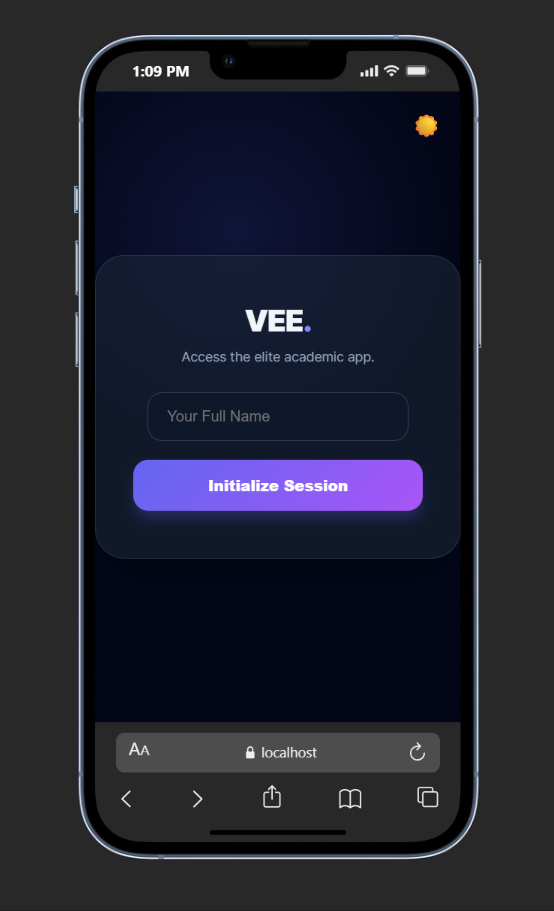
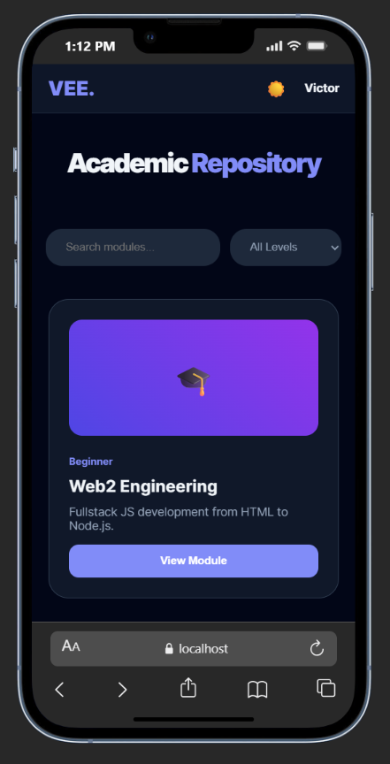
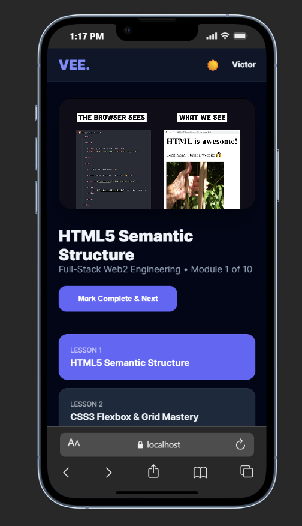

# VEE-LEARNING-HUB
THIS IS AN E-LEARNING PLATFORM BUILT WITH REACT
VEE is a premium, full-stack educational ecosystem engineered for the modern builder. It bridges the gap between basic tutorials and professional mastery in fields like Web3, UI/UX, and Data Analysis. With a focus on a "Captivating" user experience, VEE features a cinematic dark mode, high-performance video streaming, and an intelligent progression system.

---

##  The Vision

In an era of information overload, **VEE** provides a curated, distraction-free environment. Every pixel is engineered to keep the learner focused, from the typography to the glassmorphic interface that adapts perfectly to both desktop and mobile viewports.

---

##  Key Features

  * **Dual-Mode Aesthetic:** A high-contrast "Midnight Slate" theme for professional focus, with an instant toggle to "Gallery Light" mode.
  * **Specialized Tracks:** 6 core pillars of modern tech, each containing **10 progressive modules** (60+ videos total).
  * **Intelligent Unlock Logic:** Modules are strictly sequential. Users must complete the current lesson to unlock the next, ensuring a disciplined roadmap to expertise.
  * **Edge-to-Edge Responsiveness:** Optimized for 100% screen utility. No white borders or awkward gaps on mobile devices.
  * **Session Hydration:** Advanced persistence logic ensures that refreshing the page never logs you out or resets your lesson progress.
  * **Integrated Cinema Player:** A 16:9 responsive video interface designed for high-intensity technical learning.


---
## 🛠 Tech Stack

**1. Core Architecture**
* **React.js (v18+):** The declarative engine used to build the interactive UI and handle complex state logic.
* **Vite:** The lightning-fast build tool that powers the development server and optimizes the final website for production.
* **React Router Dom (v6):** Manages the **Virtual Routing** system, enabling smooth transitions between the Login, Catalogue, and Module pages without refreshing the browser.

**2. Global State & Persistence**
* **React Context API:** The "Central Brain" of the app. It manages:
    * **User Authentication:** Keeping you logged in across the site.
    * **Theme Engine:** Handling the real-time toggle between **Dark Mode** and **Light Mode**.
* **Browser LocalStorage:** Provides **Session Hydration**, ensuring that your progress (which of the 60 videos you've finished) is saved directly on your phone or PC.

**3. UI/UX & Design System**
* **CSS3 (Advanced Layouts):**
    * **Flexbox & Grid:** Used to eliminate white space and ensure the app fills **100% of the viewport**.
    * **Glassmorphism:** Created using `backdrop-filter: blur()` and semi-transparent layers for a premium, high-end feel.
    * **CSS Variables:** Used to handle the seamless color transitions during theme switching.

**4. Media & Interactivity**
* **YouTube IFrame Integration:** Powering the **Cinema Player** for all 60+ instructional videos with responsive 16:9 aspect ratios.
* **Dynamic Logic Gates:** Custom JavaScript logic that handles the **"Sequential Unlock"** system (locking Lesson 2 until Lesson 1 is marked complete).


---


## SCREENSHOT
### 1 Entrance & Authentication

    

### 2 The Learning Tracks (Catalogue)

    

### 3 The Interactive Classroom

    

---

## 📖 How to Navigate VEE

1.  **Initialize Session:** Enter your credentials on the landing page to generate your local academic profile.
2.  **Select a Frontier:** Use the **Search Bar** or **Level Filter** to find a track that matches your career goals.
3.  **Engage & Evolve:**
      * Watch the high-definition lecture at the top of the module.
      * Click **"Mark Complete & Next"** to unlock the subsequent technical deep-dive.
      * Your progress is automatically saved to your device’s local storage.


## 📥 Local Installation

```bash
# 1. Clone the repository
git clone https://github.com/viipzy/vii-learning-hub.git

# 2. Navigate to project directory
cd vii-learning-hub

# 3. Install dependencies
npm install

# 4. Start the development server
npm run dev

# 5. For mobile testing on local network
npm run dev -- --host
```

**VEE** — *Built for the Next Generation of Technical Experts.*
